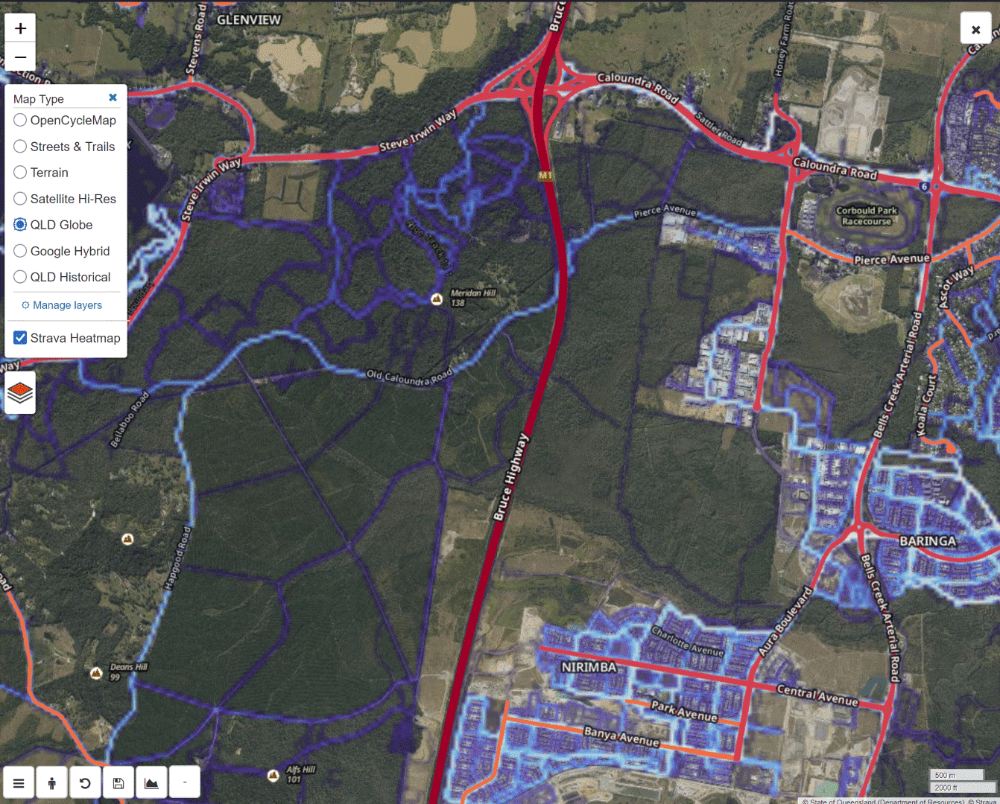
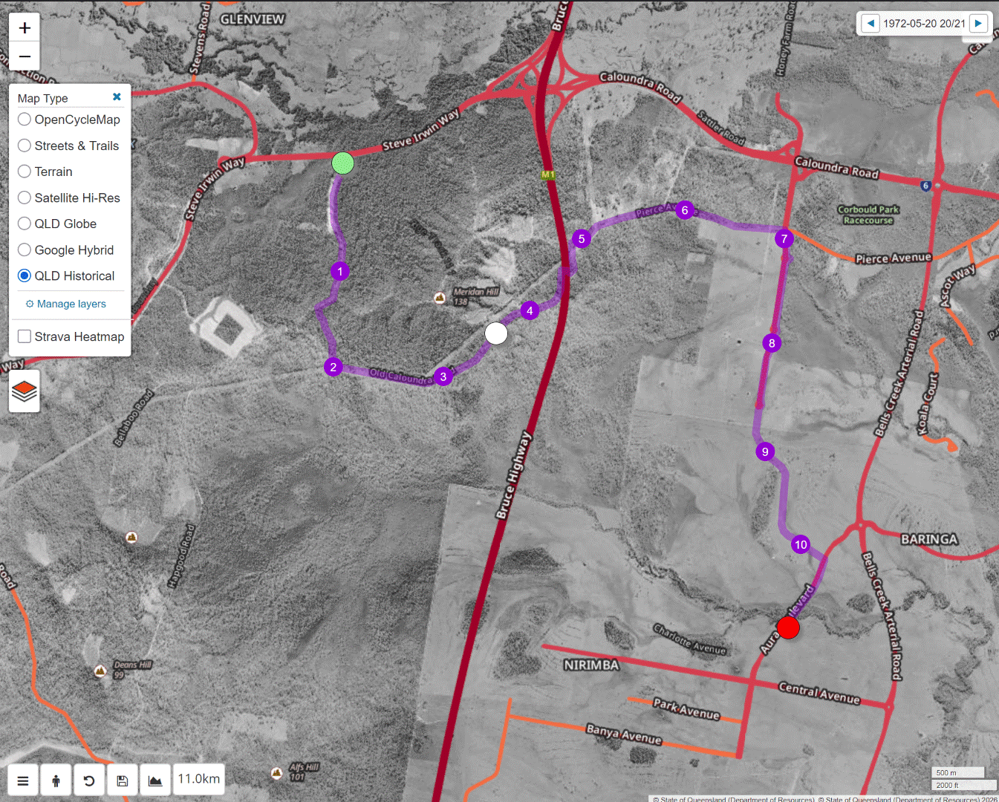
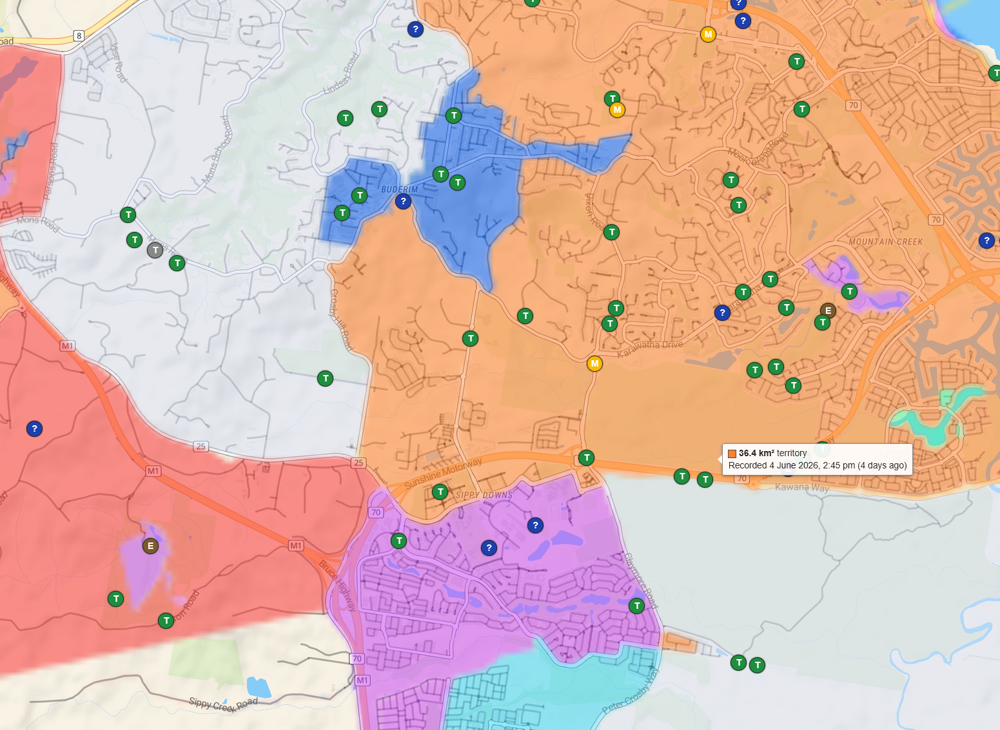

# dynamicWatch Custom Tiles

A Tampermonkey userscript that improves the [dynamicWatch](https://dynamic.watch) trip planner with better map layers and a few quality-of-life tweaks.

### Install

[](https://github.com/CalculatedCausality/dynamicWatch-Custom-Tiles/raw/main/dynamicwatch-custom-tiles.user.js)

Already have Tampermonkey? **[Click here to install](https://github.com/CalculatedCausality/dynamicWatch-Custom-Tiles/raw/main/dynamicwatch-custom-tiles.user.js)** — the link opens Tampermonkey's install dialog directly. No need to copy-paste anything.

Don't have Tampermonkey yet? [Get it for your browser](https://www.tampermonkey.net/) (Chrome, Firefox, Edge, Safari, Opera), then come back and click the install link.

---

## Features

### Base layers

The stock dynamicWatch map only ships with OpenStreetMap/topo. This script adds several base layer options, organised into two groups in the switcher:

**Global**

| Layer | Native zoom | Notes |
|---|---|---|
| **Google Hybrid** | 21 | Satellite with road labels baked in; reliable global coverage |
| **Apple Maps** | 19 | Apple's vector-styled dark map; uses an auto-refreshing access key sourced via DuckDuckGo |
| **Stamen Terrain** | 18 | Colour-shaded relief with optional labels; sourced via Stadia Maps with a localhost-spoofed Origin |
| **Esri Wayback** | 19 | Esri's archive of every World Imagery release; a date scrubber appears in the top-centre when active |

**Queensland**

| Layer | Native zoom | Notes |
|---|---|---|
| **QLD Globe** | 21 | High-res Queensland Government aerial imagery; clearest option for most of QLD |
| **QLD Historical** | 21 | Decades of aerial captures (1930s onward in parts); the date scrubber steps through every capture at the current view |
| **QLD Topo** | 16 | Queensland Government topographic basemap with contours and labels |

**QLD Labels** and **QLD Roads** are injected automatically whenever any QLD base layer is active and removed when it isn't — they don't clutter the switcher.

### Overlays

Overlays toggle on top of whichever base layer is active. They're grouped by what you're trying to see:

**Property**

| Layer | Notes |
|---|---|
| **QLD Cadastre** | Property/parcel boundaries; hover for lot/plan, tenure, area, locality, plus a **Sales ↗** link that pulls recent sale history from OnTheHouse |
| **QPWS Estate** | Protected areas, walking tracks, great walks, MTB/horse/trail-bike trails; hover for name + type |
| **QLD Relief** | Hillshade overlay at ~45% opacity for terrain context |

**Infrastructure**

| Layer | Notes |
|---|---|
| **Power Infrastructure** | Transmission/distribution lines (voltage-coloured), substations, plants, solar farms; sourced from OpenInfraMap vector tiles |
| **Telecoms** | Telephone exchanges, data centres, masts, antennas from OpenInfraMap |
| **Water Infrastructure** | Treatment plants, wastewater plants, reservoirs, towers, wells, pumping stations, trunk pipelines (OpenInfraMap, global) |
| **Mobile Coverage** | Australian Government ACCC 4G outdoor coverage grid |

**Environment**

| Layer | Notes |
|---|---|
| **National Parks** | Queensland's NP estate types (NP/NS/NY/NA) from the authoritative QPWS reference |
| **Light Pollution** | Sky brightness from `lightpollutionmap.info`; WMS-served at 65% opacity |
| **OpenSeaMap** | Nautical seamarks (buoys, lights, lanes, harbour features) |

**Live data**

| Layer | Notes |
|---|---|
| **Live Flights** | Aircraft positions from OpenSky Network, refreshed every 10s |
| **Marine Vessels** | Ship positions from MarineTraffic, refreshed every 20s |
| **INTVL Global Map** | The INTVL run-territory game's public global map; hover for territory size, owner colour, and exact recording time decoded from the activity's cuid |
| **Geocaches** | Geocaches from geocaching.com via the public tile API (no login required); shows Groundspeak's real per-type icons (traditional/mystery/earthcache/…), clickable through to each cache's page; click also fetches difficulty/terrain/owner/favourites |

**Heatmaps**

| Layer | Native zoom | Notes |
|---|---|---|
| **Strava Heatmap** | 10 | Anonymous global aggregate heatmap |
| **Garmin Heatmap** | 17 | Composited from 5 activity feeds (running, hiking, trail running, road cycling, mountain biking) with additive canvas blending |

| QLD Globe + Strava Heatmap | QLD Historical (1972) | INTVL Territories + Geocaches |
|---|---|---|
|  |  |  |

### Historical & Wayback scrubbers

When **QLD Historical** is active, a horizontal scrubber bar appears at the top of the map with prev/next arrows, a range slider, and the current capture date. Slide or click the arrows to step through every capture available at the current view. Panning to a new area refreshes the catalog automatically. **Esri Wayback** uses the same scrubber to step through every World Imagery release going back to 2014.

### Hover identify

Three layers show inline tooltips on hover:

- **QLD Cadastre** — lot/plan, name, address, tenure, area, locality, plus a **Sales ↗** link that pops a Leaflet popup with OnTheHouse property history (last sale, estimate, sales timeline)
- **QPWS Estate** — protected-area name and management type
- **INTVL Global Map** — territory size, the owner's colour swatch, and the precise recording time decoded from the activity's cuid

### Street View from any click

Right-clicking the map (or placing a waypoint) shows a popup with the usual dynamicWatch actions. The script adds a **Street View** button to the same row; opens Google Street View at that exact coordinate in a new tab.

The coordinate at the top of the popup is also click-to-copy — one tap puts `lat,lng` on your clipboard.

### Layer memory

Your last active base layer and every active overlay are saved per-browser and restored when you reload. Layer-manager preferences (which layers are hidden from the switcher) and collapsed-group state also persist.

### Layer manager

The ⚙ **Manage layers** link at the bottom of the layer switcher lets you hide layers you never use. Hidden layers stay in storage and reappear once you re-enable them.

### 3D Mode

Toggle the **3D** button next to the planner controls to flip into a tilted Mapbox GL JS view with Mapbox's Terrain-DEM elevation under your active basemap. Your route, waypoints, and active overlays mirror automatically; pan, rotate, pitch, and zoom all work. Toggle off to return to flat 2D.

GM-fetcher-backed layers such as Stamen Terrain, QLD Historical, and Garmin Heatmap render in 3D through the script's tile-blob bridge on Mapbox builds that do not expose `addProtocol`, so tiles may appear progressively as the bridge warms.

---

## Manual install (if the one-click link above doesn't work)

If Tampermonkey doesn't pop the install dialog for some reason — for example, because the GitHub raw URL hits a download instead of an `installable` redirect:

1. Install [Tampermonkey](https://www.tampermonkey.net/) for your browser.
2. Open Tampermonkey → **Create a new script**.
3. Replace everything in the editor with the contents of [`dynamicwatch-custom-tiles.user.js`](dynamicwatch-custom-tiles.user.js) and save.
4. Open [dynamic.watch/plan](https://dynamic.watch/plan); the new layers appear in the switcher straight away.

---

## How auth-gated layers work

Quick-reference table — what you need to log in to for each layer to render.

| Layer | Login required? | Source of credentials | Notes |
|---|---|---|---|
| QLD Globe | No | Script-bootstrapped QLD Gov bearer token | First-load CSRF + token POST, cached + auto-refreshed |
| QLD Historical | No | Same QLD bearer token | Some captures are restricted (HTTP 403); falls back automatically |
| QLD Roads / Labels | No | Same QLD bearer token | Auto-injected with QLD bases |
| QLD Topo | No | None | Public open WMTS |
| QLD Relief | No | None | Public QLD basemap tile cache |
| QLD Cadastre | No | None | Public ArcGIS MapServer |
| QPWS Estate / National Parks | No | None | Public ArcGIS MapServer |
| Google Hybrid | No | None | Public tile URL |
| Apple Maps | No | DuckDuckGo MapKit JWT → Apple accessKey | 30-min token, auto-refreshed |
| Stamen Terrain | No | Stadia Maps keyless endpoint | `localhost` Origin spoof via GM_xmlhttpRequest |
| Esri Wayback | No | None | Public catalog + tiles |
| OpenSeaMap | No | None | Public tiles |
| Strava Heatmap | No | Anonymous Strava endpoint | Capped at zoom 10 (higher zoom requires signed cookies) |
| Garmin Heatmap | No | Anonymous Garmin Connect tile feeds | 5 sub-feeds blended additively on canvas |
| Power / Telecoms / Water | No | OpenInfraMap MVT CDN | Public vector tiles |
| Mobile Coverage | No | ACCC public endpoint | |
| Light Pollution | No | lightpollutionmap.info WMS | |
| Live Flights | No | OpenSky Network anonymous API | Rate-limited; can return 429 |
| Marine Vessels | No | MarineTraffic anonymous endpoint | Cloudflare-protected; can drop out |
| INTVL Global Map | No | Public Mapbox Vector Tile CDN | |
| Geocaches | No | Groundspeak's public tile-info + map.details endpoints | No login. UTFGrid drives placement; lazy map.details fetch enriches on click. |

**Auto-token implementation details:**

- **QLD Globe / QLD Roads / QLD Historical** — uses QLD Government's public bearer-token endpoint. The script bootstraps a CSRF cookie + POSTs for a token on first load, caches it via Tampermonkey storage, and refreshes a few minutes before expiry. No QLD account needed.
- **Apple Maps** — uses a short-lived JWT from DuckDuckGo's MapKit proxy, then exchanges it at Apple's bootstrap endpoint for an `accessKey` (30 min TTL). Refreshes are auto-scheduled.
- **Stamen Terrain** — Stadia Maps' keyless endpoint accepts requests from a `localhost` Origin; the script spoofs that header via Tampermonkey's privileged XHR.
- **Geocaches** — uses Groundspeak's pre-2018 public tile API (`tiles{01..04}.geocaching.com`). The visible cache icons are Groundspeak's own `map.png` raster tiles (real per-type symbology) drawn via a Leaflet tile layer; the `map.info` UTFGrid (a 64×64 grid per tile encoding code + name per occupied cell) drives transparent click/hover hit-areas and the 3D dots. Cell coordinates reverse to lat/lng at tile_size/64 precision (~150 m at z=12). Difficulty/terrain/container/owner/favourites are pulled lazily from `map.details?i=GC<code>` on click. Two quirks handled transparently: `map.info` requires a `geocaching.com` Referer (real Tampermonkey sets it; the tile-layer `` requests don't need it), and "cold" tiles return HTTP 204 until a `map.png` GET warms them (the tile layer does this automatically). No login, no API key.

---

## Known limitations

- **Strava Heatmap is zoom ≤ 10 only.** Higher-zoom tiles require CloudFront signed cookies that Strava only issues via a browser session on their own site, so the layer uses the anonymous endpoint and caps at zoom 10.
- **Garmin Heatmap fires 5 requests per tile** (running, hiking, trail running, road cycling, mountain biking) and blends them additively on canvas. Other Garmin activity types don't have public tile endpoints. Each visible tile is therefore 5× the bandwidth — fast networks won't notice, mobile/cellular might.
- **QLD Historical coverage is location-dependent.** Some areas have many captures going back decades; others have few or none. The scrubber shows "Loading…" while querying the catalog.
- **QImagery (1930s–1990s aerial photos)** is part of QLD Historical but is restricted; many accounts get HTTP 403 from that scope. When that happens the layer silently falls back to the AerialOrtho program (1990s onward), with a console hint explaining why.
- **MarineTraffic is Cloudflare-protected** — vessel coverage may drop out if their bot challenge gets stricter; toggle the layer off and on to retry.

---

## Development

Tampermonkey users still install [`dynamicwatch-custom-tiles.user.js`](dynamicwatch-custom-tiles.user.js). That filename remains the bundled release artifact so existing GitHub raw install links keep updating normally.

Editable source is split under [`src/`](src/): providers, shared layer factories, the 3D runtime, UI modules, and a small boot wrapper. Rebuild the userscript after source changes:

```bash
npm run build
```

To work on it locally:

1. Install once via the link above so Tampermonkey is wired up.
2. Edit the files under `src/`, run `npm run build`, then refresh dynamic.watch. If editing through Tampermonkey's dashboard, paste from the rebuilt `dynamicwatch-custom-tiles.user.js`.

### Test suite

A multi-layer regression suite lives under [`tests/`](tests/) — see [tests/README.md](tests/README.md) for the full coverage manifest. Run from the repo root:

```bash
npm test                 # rebuild + run all suites
bash tests/run.sh        # run suites against current bundle
bash tests/run.sh --ci   # plain text output
```

- **`unit.mjs`** (57 tests, no network, ~200 ms) — pure helpers: tile geometry, MVT/protobuf decode, Cadastre formatters, OnTheHouse URL builders, INTVL date utilities, layer-provider factories, and layer-group registration. Loaded into a sandboxed `vm.createContext` via [`_loader.mjs`](tests/_loader.mjs) so the production code itself is what gets exercised.
- **`smoke.sh`** (34 tests + 7 skips, ~15 s) — HTTP probe every public layer endpoint over Brisbane CBD: HTTP 200 + content-type + minimum body size. Mapbox Terrain-DEM is skipped unless `MAPBOX_TOKEN` is set.
- **`shape.mjs`** (42 tests + 2 skips, ~15 s) — deep structural validation: PNG/JPEG magic-byte sniff, PBF decoded via the userscript's own `mvtDecode`, JSON field walks asserting every field the script reads. Also runs the full QLD CSRF token bootstrap, Apple DuckDuckGo → bootstrap chain, and the Esri Wayback catalog → release → tile pipeline end-to-end. Mapbox terrain probes are opt-in via `MAPBOX_TOKEN`.
- **`e2e/run-3d-asserts.mjs`** (8 tests, ~60 s) — Playwright-driven assertions on a real Chromium against a saved plan. Covers 3D enable, marker reprojection under rotation, waypoint drag, the rapid-toggle stress path, heatmap persistence, overlay-above-base layer order, and the 3D → 2D → 3D cycle. Needs `npm install` + `npm run e2e:install` + `npm run e2e:auth` once; see [`tests/e2e/README.md`](tests/e2e/README.md).

The suite exits with the sum of failures so it can drop into any pre-push hook.
