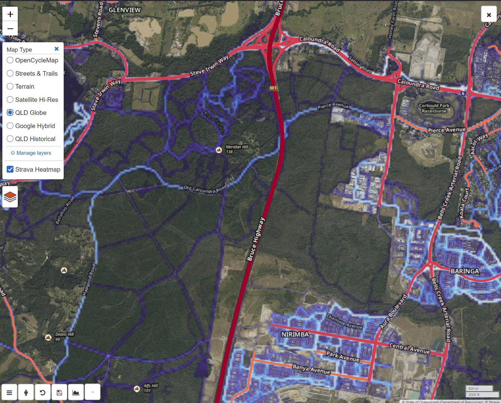
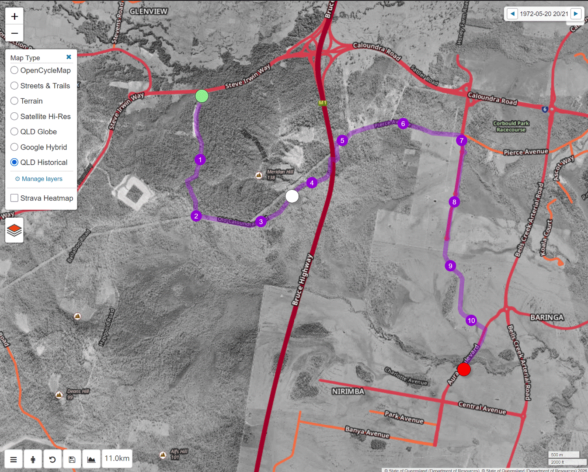
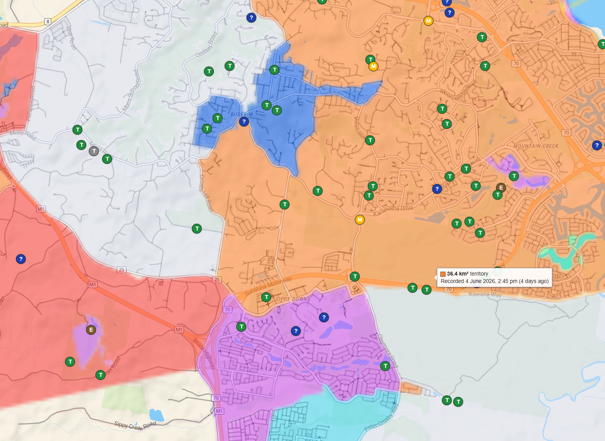

# dynamicWatch Custom Tiles

[](https://github.com/CalculatedCausality/dynamicWatch-Custom-Tiles/actions/workflows/tests.yml)

A Tampermonkey userscript that improves the [dynamicWatch](https://dynamic.watch) trip planner with better map layers and a few quality-of-life tweaks.

### Install

[](https://github.com/CalculatedCausality/dynamicWatch-Custom-Tiles/raw/main/dynamicwatch-custom-tiles.user.js)

Already have Tampermonkey? **[Click here to install](https://github.com/CalculatedCausality/dynamicWatch-Custom-Tiles/raw/main/dynamicwatch-custom-tiles.user.js)** — the link opens Tampermonkey's install dialog directly. No need to copy-paste anything.

Don't have Tampermonkey yet? [Get it for your browser](https://www.tampermonkey.net/) (Chrome, Firefox, Edge, Safari, Opera), then come back and click the install link.

---

## Features

### Base layers

The stock dynamicWatch map only ships with OpenStreetMap/topo. This script adds several base layer options, organised into two groups in the switcher:

**Global**

| Layer | Native zoom | Notes |
|---|---|---|
| **Google Hybrid** | 21 | Satellite with road labels baked in; reliable global coverage |
| **Apple Maps** | 19 | Apple's vector-styled dark map; uses an auto-refreshing access key sourced via DuckDuckGo |
| **Stamen Terrain** | 18 | Colour-shaded relief with optional labels; sourced via Stadia Maps with a localhost-spoofed Origin |
| **Esri Wayback** | 19 | Esri's archive of every World Imagery release; a date scrubber appears in the top-centre when active |
| **Vexcel Aerial** | 21 | Vexcel's dated high-res aerial mosaic (ANZ program) with a capture-date scrubber, near-infrared toggle, and an oblique compass — see [Vexcel obliques](#vexcel-obliques) below. Needs a free Vexcel viewer login |

**Queensland**

| Layer | Native zoom | Notes |
|---|---|---|
| **QLD Globe** | 21 | High-res Queensland Government aerial imagery; clearest option for most of QLD |
| **QLD Historical** | 21 | Decades of aerial captures (1930s onward in parts); the date scrubber steps through every capture at the current view |
| **QLD Topo** | 16 | Queensland Government topographic basemap with contours and labels |

**QLD Labels** and **QLD Roads** are injected automatically whenever any QLD base layer is active and removed when it isn't — they don't clutter the switcher.

### Overlays

Overlays toggle on top of whichever base layer is active. They're grouped by what you're trying to see:

**Property**

| Layer | Notes |
|---|---|
| **Australia Cadastre** | Property/parcel boundaries for **every state & territory** (QLD, NSW, VIC, SA, WA, TAS, ACT, NT). Click a parcel for lot/plan, area, locality, and — where a street address resolves — recent sale history from OnTheHouse. Rich lot/plan+address for QLD/NSW/VIC/SA/TAS/ACT; WA/NT show locality from the national dataset |
| **Postcodes** | Every postcode area in Australia as an outline with the postcode written inside, from the Australian Bureau of Statistics' 2021 Postal Areas. Hover for the postcode and its area. These are the ABS's close approximation of Australia Post postcodes, published for statistics; Australia Post's official boundaries are a paid product. Appears from zoom 9 |
| **Suburbs** | Every suburb and locality in Australia as a teal outline with its name, from the ABS's 2021 Suburbs and Localities (its close approximation of gazetted localities). Hover for the name, state and area. Shows alongside Postcodes, which are grey and dashed. Appears from zoom 11 |
| **State Land** | Queensland land the State owns, from the cadastre's tenure records, each kind in its own colour: **national park** (green), **state forest, forest reserve and timber reserve** (brown), **reserves** set aside for a community purpose (teal), **unallocated State land** (orange) and State land **held under lease** (yellow). Hover for the name, kind, lot/plan, area and locality. Appears from zoom 11. A lease is occupied by its holder, so yellow does not mean open to the public |
| **Land Use** | What each piece of Queensland is used for, from the Queensland Land Use Mapping Program, in the program's own colours (residential red, nature conservation beige, grazing pale, forestry green, water blue…). Hover for the class, its national land-use code and the year it was mapped (2011–2017 depending on the region, so recent subdivisions are missing) |
| **SCC Applications** | Sunshine Coast Council development/building/plumbing applications as colour-coded markers; an on-map submenu picks current vs decided sets; popups carry the full record, property history, documents, and a deep link into Development.i |
| **QPWS Estate** | Protected areas, walking tracks, great walks, MTB/horse/trail-bike trails; hover for name + type |
| **QLD Relief** | Hillshade overlay at ~45% opacity for terrain context |

**Infrastructure**

| Layer | Notes |
|---|---|
| **Power Infrastructure** | Transmission/distribution lines (voltage-coloured), substations, plants, solar farms; sourced from OpenInfraMap vector tiles |
| **Telecoms** | Telephone exchanges, data centres, masts, antennas from OpenInfraMap |
| **Water Infrastructure** | Treatment plants, wastewater plants, reservoirs, towers, wells, pumping stations, trunk pipelines (OpenInfraMap, global) |
| **Mobile Coverage** | Australian Government ACCC 4G outdoor coverage grid |

**Environment**

| Layer | Notes |
|---|---|
| **National Parks** | Queensland's NP estate types (NP/NS/NY/NA) from the authoritative QPWS reference |
| **Park Fire History** | Queensland Parks and Wildlife's record of planned burns and wildfires on park and forest land over the last ten years, coloured by age: red within about a year, orange 2 to 4 years ago, yellow 5 to 10. Wildfires are solid, planned burns hatched. Hover for the kind, month, park, area and how much burnt |
| **Fire Scars** | Burns detected by satellite (Sentinel-2) on all land, not only parks: red this year, orange last year. Hover for the month and area. The current year is filled in as the government updates it |
| **Natural Radiation (Australia)** | Natural gamma radiation from the ground across the whole continent, from Geoscience Australia's 2019 Radiometric Grid of Australia (merged from over 600 airborne surveys, about 100 m detail; CC BY 4.0). Drawn in GA's colour stretch: purple low, through cyan and yellow, to red high. The colours rank places against the rest of Australia; they are not danger levels, so check the reading. Hover or right-click for the reading in nGy/h, compared with the world average outdoors (59 nGy/h). Gaps are areas never surveyed. This is the official source of the Australia layer on Safecast's map, newer than Safecast's 2010 copy |
| **Radiation (Safecast)** | Background radiation measured by Safecast's volunteers worldwide, as coloured dots along the routes they drove or walked, in Safecast's own scale: dark blue through cyan is normal background (up to about 0.25 µSv/h), purple and pink are raised (about 0.3–0.6), and red, orange and yellow are high (about 1 µSv/h and above). Readings are sparse outside Japan and the US; in Australia they are mostly along main roads. Close in, where Safecast has no detailed tile, the nearest coarser one is stretched. Data CC0 |
| **Light Pollution** | Sky brightness from `lightpollutionmap.info`; WMS-served at 65% opacity |
| **OpenSeaMap** | Nautical seamarks (buoys, lights, lanes, harbour features) |

**Live data**

| Layer | Notes |
|---|---|
| **Live Flights** | Aircraft positions from OpenSky Network, refreshed every 10s |
| **Marine Vessels** | Ship positions from MarineTraffic, refreshed every 20s |
| **Waze Traffic** | Waze live-map reports — police, crashes, hazards, closures — plus jams coloured by severity and active wazers, refreshed every 30s |
| **INTVL Global Map** | The INTVL run-territory game's public global map. Hover (or long-press on a phone) a territory to see **who holds it**, their level and city, its size, the run that claimed it (distance, time, pace) and when. Everyone else's territory dims while you hover, so that runner's holdings stand out, with a count and total for the part of the map on screen. Runners who chose to be anonymous show as "Anonymous runner". A **leaderboard panel** (top right) ranks the runners holding the most territory on screen; click a runner to **pin** their territory lit (it stays pinned between visits), click again to unpin |
| **Geocaches** | Geocaches from geocaching.com via the public tile API (no login required); shows Groundspeak's real per-type icons (traditional/mystery/earthcache/…), clickable through to each cache's page; click also fetches difficulty/terrain/owner/favourites |

**Walks**

| Layer | Notes |
|---|---|
| **Aussie Bushwalking** | The walks in view from [aussiebushwalking.com](https://www.aussiebushwalking.com/)'s own walk map: a line per recorded track and a pin per walk, coloured by difficulty. Hover for distance, difficulty and duration; click for the description and a link to the walk's page. Appears from zoom 10. Walks are contributed by the site's members; the site's terms allow personal use only. |
| **AllTrails Trail Map** | The trail network AllTrails' own map draws: named, waymarked routes (green for walking, brown for mountain biking, blue for cycling), and every path and track as a thin dashed line (red where it is private, closed or needs a permit). Trails only: no parking or other place pins. Hover for the name, surface, difficulty and access; click a trail for a link that opens AllTrails on that spot. Routes appear from zoom 10, paths from 12. This is AllTrails' base map, drawn from OpenStreetMap data; AllTrails' own trail listings (ratings, reviews, photos) are not shown. The first time, the script reads AllTrails' site from your browser to find the map key it needs; if AllTrails asks for a human check, open alltrails.com once and switch the layer off and on |
| **QLD Tracks** | The tracks and walkways in Queensland's state road network: fire trails, forestry breaks, 4WD tracks and walking tracks, many missing from street maps. Roads are left out. Green = walking, horse or shared track; brown = 4WD or vehicle track; grey = track of unknown use; red dashed = private or restricted access; red dotted = closed. Hover for the name, use, access, whether it is fair-weather only, and who owns it. Appears from zoom 12 |

**Mining**

| Layer | Notes |
|---|---|
| **Mine Shafts** | Queensland's abandoned-mine physical features from the GSQ Abandoned Mine Lands program: ~10,400 mapped **mine openings** (shafts/adits), the mapped extent of **underground workings** (~8,300 points plus outlines), vents, shallow workings, pits, tailings and remediated openings. Hover a feature for what it is (e.g. "Vertical shaft", "Underground workings — Shaft"), mine name, commodity, remediation status and year of works. Best layer for pinpointing actual shafts |
| **Historic Mines** | Queensland's historical mine sites — ~15,000 "historical workings" plus historical coal workings, from the Geological Survey of Queensland (GeoResGlobe). Hover a site for its name, commodity, mine status, other commodities recorded, depth of workings, locality, and how accurately the dot is placed (many were taken from old maps and can be 200 m out) |
| **Historic Mining Leases** | Historical mining-title footprints (mining leases, claims, mineral development licences) from QLD's MinesPermitsHistoric. An old lease boundary flags mining activity even where no individual shaft was catalogued. Hover for permit number, type, status, the years it ran, minerals, and holder |
| **Old Lease Points** | The ~18,000 older leases that have no surveyed outline, most from the 1870s–1930s, as points (Gympie has over 900 of these and only a handful of outlines). Hover for the lease number, the number it had at the time, its years and mineral. Appears from zoom 13; the server labels every point, so it is busy on a goldfield |

**Reference**

| Layer | Notes |
|---|---|
| **Historic Map Sheets** | Footprint index of QLD's scanned historical maps — parish, town, topographic (incl. 1:4,752 goldfield sheets that plot individual shafts), and exploration series, 1860s–2012, filtered to local scales. **Right-click** (or long-press) a spot and the location menu lists the sheets covering it, each with a link to the scan and an **"Overlay ▦"** action that superimposes that scan on the live map. It warps through a **3×3 grid of draggable control points** (corners *plus* edge-midpoints and centre) so you can rubber-sheet out local paper/scan distortion and line old shaft/mine symbols up with real-world positions Your alignment is remembered per sheet in the browser (the 25 most recent), and **Hide points** clears the handles away so a route can be drawn over the sheet |
| **Survey Marks** | Queensland's ~124,000 survey control marks (brass plaques, star pickets, bolts in concrete, trig stations), coloured by condition: green good, orange not found, yellow disturbed, damaged or unstable; destroyed marks are left out. Hover for the mark number and name, type, street, surveyed height above sea level, condition and last visit; right-click (or long-press) a spot for the same with a link to the mark's PDF survey report, where there is one. Appears from zoom 13 (street level) |

**Heatmaps**

| Layer | Native zoom | Notes |
|---|---|---|
| **Strava Heatmap** | 11 | Anonymous global aggregate heatmap; 512 px native tiles |
| **Garmin Heatmap** | 17 | Composited from 5 activity feeds (running, hiking, trail running, road cycling, mountain biking) with additive canvas blending |

| QLD Globe + Strava Heatmap | QLD Historical (1972) | INTVL Territories + Geocaches |
|---|---|---|
|  |  |  |

### Historical & Wayback scrubbers

When **QLD Historical** is active, a horizontal scrubber bar appears at the top of the map with prev/next arrows, a range slider, and the current capture date. Slide or click the arrows to step through every capture available at the current view. Panning to a new area refreshes the catalog automatically. **Esri Wayback** uses the same scrubber to step through every World Imagery release going back to 2014, and **Vexcel Aerial** uses it to step through Vexcel's dated captures.

### Vexcel obliques

When **Vexcel Aerial** is the active base, a compass control docks on the map. Its centre button shows the flat vertical mosaic; the four cardinal buttons swap in the matching **oblique** (45°) aerial photo, warped in perspective directly on the primary map — panning, zooming, and the planner all keep working, and your route is re-projected onto the photo's own pixels so it hugs the terrain in the oblique view. The shared date scrubber steps through captures for whichever view is active, and an **IR** toggle switches the mosaic to near-infrared.

#### Save four oblique photos for an address

With Node.js 20+ and Vexcel ANZ viewer access, set **either** `VEXCEL_TOKEN` (a JWT or viewer URL containing `token=`) **or** both `VEXCEL_EMAIL` and `VEXCEL_PASSWORD` in your environment. Alternatively, save `{"email":"you@example.com","password":"your-password"}` in `~/.config/dynamicwatch-custom-tiles/vexcel-cli.json` on your device (outside the repository); the CLI will log in and mint its own token each run. Environment credentials take precedence. For example:

```bash
VEXCEL_TOKEN='your-viewer-jwt' npm run vexcel:capture -- "123 Example St, Brisbane QLD"
# For the sharpest house view, open a native-resolution crop at the matched address:
npm run vexcel:capture -- --max-zoom "34 Cottman St, Buderim QLD 4556"
# Inspect the geocoded point first, or supply a corrected point without geocoding:
npm run vexcel:capture -- --preview-location --max-zoom "34 Cottman St, Buderim QLD 4556"
npm run vexcel:capture -- --lat -26.688606 --lon 153.040973 --max-zoom "34 Cottman St, Buderim QLD 4556"
# or, with credentials already exported in your shell:
npm run vexcel:capture -- --output ./my-capture.html --no-open "123 Example St, Brisbane QLD"
```

Omit the address to enter it at the interactive prompt. The CLI checks OpenStreetMap Nominatim first; if a numbered address has no matching house number, it tries ArcGIS address geocoding and accepts only a high-confidence match with the same number. If neither can verify the number, it stops instead of using a street centre. The report shows the matched address and geocoder. It finds the newest RGB collection with all four directions (or the newest available photo per direction), downloads each full frame at a bounded pyramid resolution (up to 1600 pixels along its longest edge), and writes a self-contained HTML report with capture dates and an optional location marker. The report opens in your browser when an opener is available; otherwise its path is printed. Default output is under the ignored `captures/` directory. Imagery is embedded as JPEG data; no Vexcel token or session URL is saved in the report. Coverage and access depend on your account and address.

The report opens directly into a photo viewer. Select **N/E/S/W**, and **Top** where Vexcel has a straight-down frame; use **Fit** or **1:1 pixels** to inspect it, or **Save image** to download a self-contained SVG with the embedded JPEG tiles. With `--max-zoom`, the CLI uses Vexcel's camera projection to crop a 1536×1536 region centred on the address at native image resolution; if that projection is unavailable, it stops rather than capture the wrong area. This can require many more tile requests than the full-frame preview.

If the address match is off, use `--preview-location` to inspect the mapped point before downloading imagery, or give both `--lat` and `--lon` to use a corrected WGS84 point. Completed image tiles are cached under `.vexcel-tile-cache/` beside the report, so rerunning an interrupted capture downloads only missing tiles. The CLI prunes cache entries older than 30 days and caps remaining tiles at 512 MiB. Both the report and cache are ignored when the default `captures/` output is used.

To process several addresses, create a UTF-8 CSV with an `address` header and optional `lat,lon` columns (both values per row or neither). Run `npm run vexcel:capture -- --csv addresses.csv --max-zoom --output captures/my-batch`. Each address gets a separate HTML report, and `index.html` lists successes and failures. The batch respects Nominatim's one-request-per-second limit; manually specified coordinates skip geocoding.

### Hover identify

A few layers show inline tooltips on hover:

- **Australia Cadastre** — lot/plan, name, address, tenure, area, locality (any state/territory), plus OnTheHouse property history (last sale, estimate, sales timeline) auto-loaded inline where a street address resolves
- **QPWS Estate** — protected-area name and management type
- **Mine Shafts** — what the feature is (e.g. "Vertical shaft"), mine name, commodity, remediation status, and year of works
- **Historic Mines** — mine site name, commodity, mine status, other commodities, depth of workings, locality, and position accuracy
- **Historic Mining Leases** and **Old Lease Points** — permit number, type, status, years, minerals, former number, and holder
- **State Land** — name, kind of tenure, lot/plan, area, and locality
- **Land Use** — land-use class, national code, and year mapped

With any mining overlay, State Land, Land Use, Survey Marks, QLD Tracks, a fire overlay, Postcodes or Suburbs on, **right-click** (or long-press on a phone) a spot and the location menu lists everything recorded there, not only the one under the pointer.
- **INTVL Global Map** — the runner's name, level and city, territory size, the claiming run's distance, time and pace, when it was captured, and how much that runner holds on screen

### POIs along your route

The **signpost** button in the planner toolbar (beside 3D) finds useful stops along the route you've drawn and pins them on the map: drinking water, toilets, cafés and food, shops and fuel, viewpoints and peaks, shelters and campsites, car parks and picnic areas, pharmacies and hospitals, and bike shops or repair stands. A panel lists them in route order with their distance along the route (both passes on an out-and-back), and category chips show or hide each type. Choose a 50–500 m corridor; your choice and hidden categories are remembered.

It also finds **course points** on the route itself, so your watch's Up Ahead list shows what's coming:

- **Climbs** and **climb tops**: rises of at least 40 m averaging 3% or more, from [AWS Terrain Tiles](https://registry.opendata.aws/terrain-tiles/) elevation data (about 35 m resolution). A climb ends where the route levels out or drops more than about 12 m. A climb is named like `Climb 171m 3.7k` and its top `Top 171m climb`. The popup gives the average and steepest gradient. On watches without ClimbPro, such as the Instinct 3, this gives you a climb list in Up Ahead.
- **Creek crossings**, named where the map names the creek
- **Track sections**: where the route moves onto a differently named track or road, such as `Turpentine Track`

In Queensland it also lists **named survey marks** near the route (the hilltop and landmark stations, such as Baroon or Big Pineapple, not the numbered plaques in footpaths), each with its surveyed height. Their chip starts switched off; tap it to show them.

Each kind has its own chip, so you can hide the ones you don't want before adding waypoints.

**Build Up Ahead** makes the plan's waypoints match what's shown, in one step:

- It adds one item per 100 m stretch of the route: the most useful one. The order is water, toilets, food and shops, medical, climbs, creek crossings, track sections, then picnic areas and car parks. The panel says how many it left out; add any of those with its **+** button.
- Press it again after editing the route or hiding a kind, and it replaces only the waypoints the script added before: ones no longer wanted are removed, missing ones are added, and names are refreshed.
- Waypoints you added yourself are never removed, and neither is one of the script's that you have renamed or moved. A stretch that has one of yours gets nothing more.
- The whole build is a single Undo step.

The script remembers which waypoints it added for each saved route in your userscript manager's storage, on this browser only.

Above the list, the panel shows the **longest stretch without drinking water**, measured along the route from the start to the finish (or "No drinking water within 100 m of the route"). If cafés and shops shorten it noticeably, a second line gives that figure too. Click either line to highlight that stretch on the map.

**Waypoint names** sets what POI waypoints are called: the name alone (the default) or distance and name (`4.2k Kiosk`). dynamic.watch sends only a waypoint's position and name to the watch, within its name limit (16 characters on most accounts). If the route changes before a waypoint, or you change this setting, names the script wrote go out of date; the panel then offers **Update names**, which renames them in one Undo step. Names you typed yourself are left alone. When a name wouldn't otherwise fit, common words are shortened (Creek → Ck, Track → Trk, Road → Rd), and climbs drop to `Climb 171m` or `+171m`.

While the POIs are shown, they follow your edits: add, drag or delete route points and the list and pins update a couple of seconds after the route settles. **Search again** re-runs it at any time.

Click a pin or list entry for details, then **Add as waypoint** (or **Build Up Ahead**) to add it to the plan as a named waypoint — dynamic.watch sends waypoints to your watch once you **save** the route, and Undo removes them. A row you've added shows a tick; click the tick to take that waypoint off the plan again. Press the button again to clear the POIs. Pins work in 3D Mode too.

POI data comes from OpenStreetMap via [OpenFreeMap](https://openfreemap.org/)'s keyless vector tiles, so coverage is only as good as local OSM mapping; very long routes (roughly 300 km or more) need splitting.

### Google Maps from any click

Right-clicking the map (or placing a waypoint) shows a popup with the usual dynamicWatch actions. The script adds a **Google Maps** button to the same row; it opens a pin at that coordinate in a new tab. From there, use Google Maps' pegman to enter Street View where available.

The coordinate at the top of the popup is also click-to-copy — one tap puts `lat,lng` on your clipboard.

The same popup has an **AllTrails** button. It opens AllTrails' own Explore page on the area you are looking at (or about 10 km around the spot if the map is zoomed far in or out). It is a plain link, separate from the AllTrails Trail Map overlay.

### Layer memory

Your last active base layer and every active overlay are saved per-browser and restored when you reload. Layer-manager preferences (which layers are hidden from the switcher) and collapsed-group state also persist.

### Layer manager

The ⚙ **Manage layers** link at the bottom of the layer switcher lets you hide layers you never use. Hidden layers stay in storage and reappear once you re-enable them.

### 3D Mode

Toggle the **3D** button next to the planner controls to flip into a tilted Mapbox GL JS view with Mapbox's Terrain-DEM elevation under your active basemap. Your route, waypoints, and active overlays mirror automatically; pan, rotate, pitch, and zoom all work. Toggle off to return to flat 2D.

GM-fetcher-backed layers such as Stamen Terrain, QLD Historical, and Garmin Heatmap render in 3D through the script's tile-blob bridge on Mapbox builds that do not expose `addProtocol`, so tiles may appear progressively as the bridge warms.

### Userscript menu

On dynamic.watch pages, open your userscript manager's menu (the Tampermonkey icon) to:

- change your Vexcel login
- sign out of Vexcel on this device
- reset CustomTiles layer and panel preferences
- report a problem

**Diagnostics / report a problem** opens a copyable, redacted report with version details, active layers, whether each login is working (yes/no only) and recent CustomTiles warnings and errors. Resetting preferences keeps saved logins and your dynamic.watch data, and offers to reload the page.

---

## Manual install (if the one-click link above doesn't work)

If Tampermonkey doesn't pop the install dialog for some reason — for example, because the GitHub raw URL hits a download instead of an `installable` redirect:

1. Install [Tampermonkey](https://www.tampermonkey.net/) for your browser.
2. Open Tampermonkey → **Create a new script**.
3. Replace everything in the editor with the contents of [`dynamicwatch-custom-tiles.user.js`](dynamicwatch-custom-tiles.user.js) and save.
4. Open [dynamic.watch/plan](https://dynamic.watch/plan); the new layers appear in the switcher straight away.

---

## How auth-gated layers work

Quick-reference table — what you need to log in to for each layer to render.

| Layer | Login required? | Source of credentials | Notes |
|---|---|---|---|
| QLD Globe | No | Script-bootstrapped QLD Gov bearer token | First-load CSRF + token POST, cached + auto-refreshed |
| QLD Historical | No | Same QLD bearer token | Some captures are restricted (HTTP 403); falls back automatically |
| QLD Roads / Labels | No | Same QLD bearer token | Auto-injected with QLD bases |
| QLD Topo | No | None | Public open WMTS |
| QLD Relief | No | None | Public QLD basemap tile cache |
| Australia Cadastre | No | None | Per-state public ArcGIS services + national Geoscape fallback (WA/ACT/NT) |
| QPWS Estate / National Parks | No | None | Public ArcGIS MapServer |
| Historic Mines | No | None | GSQ MiningResources public ArcGIS MapServer (same host as cadastre) |
| Google Hybrid | No | None | Public tile URL |
| Apple Maps | No | DuckDuckGo MapKit JWT → Apple accessKey | 30-min token, auto-refreshed |
| Stamen Terrain | No | Stadia Maps keyless endpoint | `localhost` Origin spoof via GM_xmlhttpRequest |
| Esri Wayback | No | None | Public catalog + tiles |
| Vexcel Aerial | Yes | Vexcel viewer account | Paste `email:password` once (stored on-device, daily JWT auto-refreshed) or a one-off token/URL from the Vexcel viewer |
| SCC Applications | No | None | Public ArcGIS Feature Layers + Development.i endpoints |
| OpenSeaMap | No | None | Public tiles |
| Strava Heatmap | No | Anonymous Strava endpoint | Capped at URL zoom 11 (512 px tiles; higher zoom requires signed cookies) |
| Garmin Heatmap | No | Anonymous Garmin Connect tile feeds | 5 sub-feeds blended additively on canvas |
| Power / Telecoms / Water | No | OpenInfraMap MVT CDN | Public vector tiles |
| Mobile Coverage | No | ACCC public endpoint | |
| Light Pollution | No | lightpollutionmap.info WMS | |
| Live Flights | No | OpenSky Network anonymous API | Rate-limited; can return 429 |
| Marine Vessels | No | MarineTraffic anonymous endpoint | Cloudflare-protected; can drop out |
| Waze Traffic | No | Waze live-map georss (reCAPTCHA-gated) | Token minted in a hidden `embed.waze.com` iframe; activates at z≥9. Manual override: `GM_setValue("dw_waze_token_manual", "<token>")` |
| INTVL Global Map | No | Public Mapbox Vector Tile CDN | |
| State Land, Land Use | No | Queensland Government ArcGIS (cadastre tenure; QLUMP land use) | Same host as the cadastre |
| AllTrails Trail Map | No (reads AllTrails' site from your browser once) | AllTrails' map tiles, hosted on Mapbox | The map key is looked up in your browser and kept there; it is not in the script |
| Postcodes, Suburbs | No | ABS 2021 Postal Areas and Suburbs and Localities (geo.abs.gov.au) | CC BY 4.0 |
| Aussie Bushwalking | No | aussiebushwalking.com's walk-map vector tiles | Read only while the overlay is on |
| Geocaches | No | Groundspeak's public tile-info + map.details endpoints | No login. UTFGrid drives placement; lazy map.details fetch enriches on click. |

**Auto-token implementation details:**

- **Vexcel Aerial** — requires your own [ANZ viewer](https://anz-viewer.vexcelgroup.com) login or a one-off token; no account is included in the script. The prompt accepts `email:password` for on-device GM storage and automatic token refresh, or a token/URL for use until it expires. Rejected credentials remain stored, but automatic login stops until you enter credentials again; an existing token is retained.
- **QLD Globe / QLD Roads / QLD Historical** — uses QLD Government's public bearer-token endpoint. The script bootstraps a CSRF cookie + POSTs for a token on first load, caches it via Tampermonkey storage, and refreshes a few minutes before expiry. No QLD account needed.
- **Apple Maps** — uses a short-lived JWT from DuckDuckGo's MapKit proxy, then exchanges it at Apple's bootstrap endpoint for an `accessKey` (30 min TTL). Refreshes are auto-scheduled.
- **Stamen Terrain** — Stadia Maps' keyless endpoint accepts requests from a `localhost` Origin; the script spoofs that header via Tampermonkey's privileged XHR.
- **Geocaches** — uses Groundspeak's pre-2018 public tile API (`tiles{01..04}.geocaching.com`). The visible cache icons are Groundspeak's own `map.png` raster tiles (real per-type symbology) drawn via a Leaflet tile layer; the `map.info` UTFGrid (a 64×64 grid per tile encoding code + name per occupied cell) drives transparent click/hover hit-areas and the 3D dots. Cell coordinates reverse to lat/lng at tile_size/64 precision (~150 m at z=12). Difficulty/terrain/container/owner/favourites are pulled lazily from `map.details?i=GC<code>` on click. Two quirks handled transparently: `map.info` requires a `geocaching.com` Referer (real Tampermonkey sets it; the tile-layer `` requests don't need it), and "cold" tiles return HTTP 204 until a `map.png` GET warms them (the tile layer does this automatically). No login, no API key.

## Known limitations

- **Strava Heatmap is capped at URL zoom 11.** The anonymous endpoint supplies 512 px tiles at that level (roughly the sampling of a conventional 256 px z12 tile), which the layer overzooms when the map is closer. Actual higher-detail tiles require short-lived CloudFront signed cookies from a logged-in Strava session, so the script does not request or proxy them.
- **Garmin Heatmap fires 5 requests per tile** (running, hiking, trail running, road cycling, mountain biking) and blends them additively on canvas. Other Garmin activity types don't have public tile endpoints. Each visible tile is therefore 5× the bandwidth — fast networks won't notice, mobile/cellular might.
- **QLD Historical coverage is location-dependent.** Some areas have many captures going back decades; others have few or none. The scrubber shows "Loading…" while querying the catalog.
- **QImagery (1930s–1990s aerial photos)** is part of QLD Historical but is restricted; many accounts get HTTP 403 from that scope. When that happens the layer silently falls back to the AerialOrtho program (1990s onward), with a console hint explaining why.
- **MarineTraffic is Cloudflare-protected** — vessel coverage may drop out if their bot challenge gets stricter; toggle the layer off and on to retry.

---

## Development

Tampermonkey users still install [`dynamicwatch-custom-tiles.user.js`](dynamicwatch-custom-tiles.user.js). That filename remains the bundled release artifact so existing GitHub raw install links keep updating normally.

Editable source is split under [`src/`](src/): providers, shared layer factories, the 3D runtime, UI modules, and a small boot wrapper. Rebuild the userscript after source changes:

```bash
npm run build
```

To work on it locally:

1. Install once via the link above so Tampermonkey is wired up.
2. Edit the files under `src/`, run `npm run build`, then refresh dynamic.watch. If editing through Tampermonkey's dashboard, paste from the rebuilt `dynamicwatch-custom-tiles.user.js`.

The build also writes `dynamicwatch-custom-tiles.meta.js`, the header on its own. Installed copies poll it through `@updateURL` and download the full script from `@downloadURL` (both on `main`) when `@version` goes up, so **bump `@version` in `src/userscript-header.txt` for every release**. Turn off Tampermonkey's update check for your copy while testing local edits, or it may replace them with the published version.

Commit the rebuilt files with your source changes. `npm run check:bundle` fails if they're out of date, and CI runs it on every push and pull request.

`npm run check:version` compares the committed userscript against `origin/main` (choose another base with `-- --base <ref>`). Whenever the bundle changes, it requires a higher `@version` and a matching `### Release notes — <version>` section with at least one bullet in this README. If the base can't be resolved, it skips with a notice. CI runs it on pushes and pull requests. Once the offline checks pass on `main`, CI publishes a GitHub release `v<version>` with the userscript attached and these release notes, unless that tag already exists.

### Test suite

A multi-layer regression suite lives under [`tests/`](tests/) — see [tests/README.md](tests/README.md) for the full coverage manifest. Run from the repo root:

```bash
npm test                 # rebuild + offline checks (no network)
npm run test:live        # rebuild + network and authenticated browser checks
npm run test:all         # rebuild + both suites
bash tests/run.sh        # offline checks against current bundle
bash tests/run.sh --ci   # plain text output
```

[GitHub Actions](.github/workflows/tests.yml) runs the bundle check and the offline suite on every push to `main` and every pull request. The live endpoint checks can be started by hand from the Actions tab (**Run workflow** → tick *live*); browser checks that need a dynamic.watch login skip there.

- **`unit.mjs`** (116 tests, no network) — pure helpers: tile geometry, MVT/protobuf decode, Cadastre formatters, historical-map URLs, OnTheHouse URL builders, INTVL date utilities, layer-provider factories, and layer-group registration. Loaded into a sandboxed `vm.createContext` via [`_loader.mjs`](tests/_loader.mjs) so the production code itself is what gets exercised.
- **Source-level regressions** (`polling-data-layer.mjs`, `viewport-layers.mjs`, `route-pois.mjs`, `route-profile.mjs`, `route-features.mjs`, `planner-toolbar.mjs`, `mode-3d-sync.mjs`, `aussie-bushwalking.mjs`, `hover-stack.mjs`, `userscript-menu.mjs`, `release-scripts.mjs`, `vexcel-*.mjs`, `lightpoll-token.mjs`; no network) — async overlay freshness/retries, route-POI geometry and waypoints, course points (creek crossings, track sections and climb detection), the elevation profile (Terrarium decoding and fetching with stubbed requests), the userscript menu and its redaction, the version-bump and release-notes scripts, and the Vexcel capture CLI with mocked services. `check-secrets.mjs` checks shipped source and bundle for embedded credentials.
- **`smoke.sh`** (34 tests + 7 skips, ~15 s) — HTTP probe every public layer endpoint over Brisbane CBD: HTTP 200 + content-type + minimum body size. Mapbox Terrain-DEM is skipped unless `MAPBOX_TOKEN` is set.
- **`shape.mjs`** (42 tests + 2 skips, ~15 s) — deep structural validation: PNG/JPEG magic-byte sniff, PBF decoded via the userscript's own `mvtDecode`, JSON field walks asserting every field the script reads. Also runs the full QLD CSRF token bootstrap, Apple DuckDuckGo → bootstrap chain, and the Esri Wayback catalog → release → tile pipeline end-to-end. Mapbox terrain probes are opt-in via `MAPBOX_TOKEN`.
- **`e2e/run-3d-asserts.mjs`** (12 tests, ~2 min) — Playwright-driven assertions on a real Chromium against a saved plan. Covers 3D enable, marker reprojection under rotation, waypoint drag, the rapid-toggle stress path, heatmap persistence, overlay-above-base layer order, the 3D → 2D → 3D cycle, overlay toggles leaving the base map alone, hover pop-ups on layers added after 3D, no error flood when 3D is switched off mid-load, and recovery when 3D cannot start. Needs `npm install` + `npm run e2e:install` + `npm run e2e:auth` once; see [`tests/e2e/README.md`](tests/e2e/README.md).
- **`e2e/verify-raster-security.mjs`** — verifies public QLD Topo raster tiles in 2D and 3D under normal Chromium CORS and site-isolation rules.
- **`e2e/verify-route-pois.mjs`** — presses the POI button on a saved route and checks route-ordered pins, category filtering, popups, adding a POI as a waypoint (including distance names), climbs, creek crossings and track sections on the route, removing a waypoint with a row's tick, refreshing names, Build Up Ahead (adding, one-step Undo, replacing only its own waypoints), list clicks opening popups beside the panel, the script's toolbar buttons being spaced and labelled like the native ones, and that no click leaks through to the planner. Run with `npm run e2e:route-pois`; also part of `npm run test:live`.
- **`e2e/verify-vexcel-report.mjs`** — checks that offline Vexcel reports decode embedded JPEGs in all four directions, auto-open the result modal, switch photos, and support native 1:1 and fit controls (synthetic local imagery; no Vexcel login required). Run with `npm run e2e:vexcel-report`.

### Release notes — 7.32.1

- Fixed: clicking a runner in the INTVL leaderboard also added a point to the route.

### Release notes — 7.32.0

- **One hover box.** With several overlays on, their hover details now show together in one box (INTVL runner first), instead of separate boxes covering each other.

### Release notes — 7.31.0

- New **Natural Radiation (Australia)** overlay (in Environment, off by default): Geoscience Australia's 2019 map of natural radiation across the continent, with the reading on hover. Tampermonkey will ask to allow `services.ga.gov.au`.
- New **Radiation (Safecast)** overlay (in Environment, off by default): Safecast's crowd-sourced background radiation readings.
- Fixed: the Suburbs overlay did not stack in its place among the other layers (its order value was not a whole number, which browsers ignore).

### Release notes — 7.30.0

- New **Suburbs** overlay (in Property, off by default): every suburb and locality in Australia, outlined and named, from the ABS.

### Release notes — 7.29.0

- New **Postcodes** overlay (in Property, off by default): every postcode area in Australia, outlined and labelled, from the ABS. Tampermonkey will ask to allow `geo.abs.gov.au` when it updates.

### Release notes — 7.28.0

- The POI finder lists **named survey marks** near the route in Queensland, with their surveyed heights. Their chip starts switched off.

### Release notes — 7.27.0

- New **Park Fire History** overlay: planned burns and wildfires on Queensland park and forest land over ten years, coloured by age.
- New **Fire Scars** overlay: satellite-detected burns on all land, this year and last.

### Release notes — 7.26.0

- **INTVL leaderboard:** with INTVL Global Map on, a panel ranks the runners holding the most territory on screen. Click a runner to pin their territory lit; it stays pinned between visits.

### Release notes — 7.25.0

- New **QLD Tracks** overlay (in Walks, off by default): Queensland's fire trails, forestry breaks, 4WD and walking tracks, coloured by use, with private, restricted and closed tracks in red.

### Release notes — 7.24.0

- New **Survey Marks** overlay (in Reference, off by default): Queensland's survey control marks coloured by condition, with height, last visit and a link to each mark's survey report.

### Release notes — 7.23.2

- Fixed: **QLD Globe** imagery stayed blank. The QLD Globe site changed how its page carries the security code the script needs to get an access token, so no token was issued.

### Release notes — 7.23.1

- **AllTrails Trail Map shows trails only.** The parking, toilet and other place pins are gone.
- **Click a trail** for a pop-up with a link that opens AllTrails on that spot. Trails are also easier to hover and click.

### Release notes — 7.23.0

- New **AllTrails Trail Map** overlay (in Walks, off by default): the routes, paths, tracks and trail facilities AllTrails' own map draws, with private and closed paths in red.
- New **AllTrails** button in the right-click / long-press popup: opens AllTrails on the area you are looking at.
- Tampermonkey will ask to allow `www.alltrails.com` and `cloudfront.net` when it updates; the overlay needs both.

### Release notes — 7.22.0

- **INTVL Global Map shows who holds each territory.** INTVL's public map now sends the runner's name, so the hover shows it with their level, city and the run that claimed the territory. Hovering dims everyone else's territory and totals what that runner holds on screen. Anonymous runners stay anonymous.
- Fixed: some territories showed a made-up "recorded" time; the time is now only shown when it agrees with the capture day.

### Release notes — 7.21.0

- New **State Land** overlay: national parks, state forests, reserves, unallocated State land and State leases across Queensland, each in its own colour.
- New **Land Use** overlay: what each piece of Queensland is used for, from the Queensland Land Use Mapping Program.
- Both are in the Property group, off by default, and list what is at a spot on right-click or long-press.

### Release notes — 7.20.0

- **Mining overlays say more.** Historic Mines adds the other commodities recorded, the depth of workings, the year recorded, and how far out the dot may be. Leases show the years they ran and the number they had at the time. Mine Shafts names features that had no type of their own.
- **Mine Shafts draws more**: the mapped extent of underground workings, vents, tailings, remediated openings and the pit and shallow-workings areas.
- New **Old Lease Points** overlay: the ~18,000 older leases with no surveyed outline.
- **Right-click (or long-press) lists everything at a spot** for whichever mining overlays are on. This is the only way to read them on a phone.
- **Historic Map Sheets remembers your alignment.** After you drag a sheet's points into place it is saved in the browser, and the sheet comes back aligned next time. "Reset points" forgets it. **Hide points** leaves the sheet as a plain backdrop so you can draw a route over it.

### Release notes — 7.19.0

- **Build Up Ahead** replaces "Add shown as waypoints". It adds what's shown, and pressing it again after a route edit replaces only the waypoints it added before; yours are never removed. Each build is a single Undo step.
- New **Aussie Bushwalking** overlay: the walks and recorded tracks in view, coloured by difficulty, each linking to its page on aussiebushwalking.com.
- **Update names**: when a route edit or the name setting leaves distance names such as `4.2k Kiosk` out of date, the panel offers to rename them.

### Release notes — 7.18.1

- 3D Mode: switching an overlay on or off no longer blanks the base map and reloads every tile; only the layer you changed loads.
- 3D Mode: if 3D can't start (the 3D library didn't download, or the browser has no WebGL), the 2D map comes back and the button un-presses; pressing it again retries. Before, the map could be left blank and 3D stayed broken until a page reload.
- 3D Mode: hover pop-ups now work for layers switched on after 3D (geocaches, INTVL, flights, vessels, Waze).
- 3D Mode: shapes and the route update in place instead of being rebuilt on every mouse movement over the map, and lines from overlays are no longer drawn twice.
- 3D Mode: switching 3D off while it is loading no longer fills the console with errors.

### Release notes — 7.18.0

- In the POI list, the tick on a row you've added now removes that waypoint again. The planner's Undo brings it back.
- The 3D and POI toolbar buttons show the same hover label as dynamic.watch's own buttons.

### Release notes — 7.17.1

- The 3D and POI buttons in the planner toolbar are now spaced like dynamic.watch's own buttons. They used to sit flush against each other and the distance readout.

### Release notes — 7.17.0

- Removed **Timing & conditions** from the POI panel (start time, pace, finish estimate, daylight and forecast), along with arrival times in the list and the distance-and-time waypoint names. None of it reached the watch except as fixed text in names, and a watch's Virtual Partner can pace you live instead. Waypoint names keep the distance option.
- The script no longer contacts Open-Meteo.

### Release notes — 7.16.0

- POIs along your route now include **course points** for your watch's Up Ahead list: climbs and their tops, creek crossings, and named track and road sections. Car parks and picnic areas are found too.
- Climbs are named like `Climb 171m 3.7k`, giving watches without ClimbPro a climb list in Up Ahead. Each climb's popup shows its average and steepest gradient and the time to the top.
- **Add shown as waypoints** adds only the most useful item where several fall within 100 m (toilets rather than the car park beside them), so they don't crowd Up Ahead.
- Waypoint names shorten common words (Creek → Ck, Road → Rd) when they wouldn't otherwise fit.
- The POI panel gives its list more room, and clicking a list entry opens its popup beside the panel instead of under it.

### Release notes — 7.15.0

- **Timing & conditions** in the POI panel: set a start time and pace to get arrival times for every POI and the finish. Estimates account for climbing using elevation data, and the panel shows stretches in the dark and the forecast along the route at your arrival times.
- The water line shows how long the stretch without water takes, with a rough drinking guide.
- POI waypoint names can include the distance and arrival time, so they reach your watch.
- New userscript-manager menu: change or sign out of your Vexcel login, reset layer and panel preferences, and copy a redacted diagnostics report for bug reports.
- Each new version is now published as a GitHub release.

### Release notes — 7.14.0

- POIs along your route now show the longest stretch without drinking water (and with cafés and shops counted), with a click to highlight it on the map.
- The POI list and pins update by themselves when you edit the route, and keep their scroll position while you add waypoints.
- Installed copies update from `main` through `@updateURL`/`@downloadURL`; tests run on GitHub Actions.

### Release notes — 7.13.0

- New **POIs along your route** button in the planner toolbar: finds water, toilets, food, shops, views, shelter, medical and bike stops near the route, lists them by distance along it, and adds any of them to the plan as named waypoints.

### Release notes — 7.12.0

- Vexcel now prompts for each user's own viewer account (or token) instead of using a bundled account. Existing on-device logins continue to refresh automatically.
- Live overlays discard obsolete responses; ArcGIS and vector-tile overlays recover from failed or oversized queries. Historical scan links are validated.
- Strava uses its working external heatmap CDN; Light Pollution follows the current public tokenized WMS endpoint.
- The local capture CLI accepts address or exact coordinates, supports batch CSV, native house crops, cache resume/pruning, and five-view reports with image downloads. Offline and live tests can be run separately.

The suite exits with the sum of failures so it can drop into any pre-push hook.
